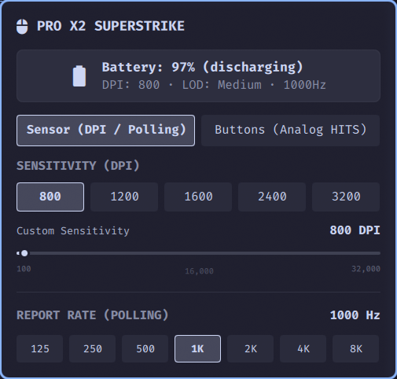

# Logitech G Mouse

**English** | [繁體中文](README.zh-tw.md)

An [Omarchy Quattro](https://omarchy.org/) bar widget and control panel for Logitech G gaming mice. It reads battery status and lets you adjust DPI, report rate, and—on supported mice—HITS analog-switch settings without Logitech G HUB.

## Requirements

- Omarchy Quattro on x86_64 Linux.
- A Logitech G mouse reachable through `/dev/hidraw`.

The plugin includes its native controller. Bun, Node.js, Python, and Rust are not required to use it.

## Install

### From GitHub

```bash
omarchy plugin add https://github.com/ttymayor/oma-logitech-g-mouse.git --enable
omarchy restart shell
```

### From a local checkout

```bash
mkdir -p ~/.config/omarchy/plugins/tantuyu.logitech-g-mouse
cp -a . ~/.config/omarchy/plugins/tantuyu.logitech-g-mouse/
omarchy plugin validate ~/.config/omarchy/plugins/tantuyu.logitech-g-mouse
omarchy-shell shell rescanPlugins
omarchy plugin enable tantuyu.logitech-g-mouse --section right
omarchy restart shell
```

## Use

- **Left-click** the bar widget to open the control panel.
- **Right-click** it to toggle battery percentage text.
- Use **Sensor** to select DPI presets, set DPI in 50-DPI steps, and choose a supported report rate.
- Use **Buttons** on compatible analog-switch mice to set Actuation Point, Rapid Trigger, and Click Haptics per button.

The widget automatically reconnects after startup or a receiver reconnect. It waits up to five seconds for the receiver to become ready.

## Screenshots

| Sensor tab                                                                      | Buttons tab                                                            |
| ------------------------------------------------------------------------------- | ---------------------------------------------------------------------- |
|  |  |

## Troubleshooting

On Omarchy and other systemd desktop sessions, `systemd-logind` normally grants the logged-in user access to `/dev/hidraw*` through `uaccess`.

If the widget stays disconnected, first check whether the native controller can see the mouse:

```bash
~/.config/omarchy/plugins/tantuyu.logitech-g-mouse/bin/logitech-g-daemon --once
```

If it returns `EACCES: Permission denied`, your session lacks HID device access. This can occur in containers, headless sessions, or systems without `systemd-logind`. Keep the normal `uaccess` path when available. For a headless system, grant access only to a dedicated local group:

```bash
sudo groupadd --system logitech-hidraw
sudo usermod -aG logitech-hidraw "$USER"
sudo tee /etc/udev/rules.d/42-logitech-mouse.rules << 'EOF'
SUBSYSTEM=="hidraw", ATTRS{idVendor}=="046d", GROUP="logitech-hidraw", MODE="0660"
EOF
sudo udevadm control --reload
sudo udevadm trigger
```

Log out and back in before using the new group membership.

## Uninstall

```bash
omarchy plugin disable tantuyu.logitech-g-mouse
omarchy plugin remove tantuyu.logitech-g-mouse --yes
omarchy restart shell
```

For a manually installed plugin:

```bash
omarchy plugin disable tantuyu.logitech-g-mouse
rm -rf "${XDG_RUNTIME_DIR:-/run/user/$UID}/omarchy-logitech-g-mouse"
omarchy restart shell
```

## Development

See [DEVELOPMENT.md](DEVELOPMENT.md) for building the native controller, protocol notes, verification, and release automation.

## License

MIT License. Logitech, G PRO, and SUPERSTRIKE are trademarks of Logitech. This project is an independent third-party open-source plugin and is not affiliated with Logitech.
