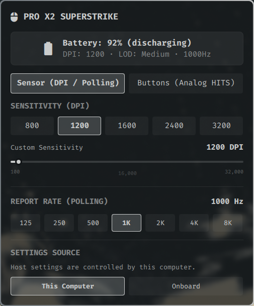
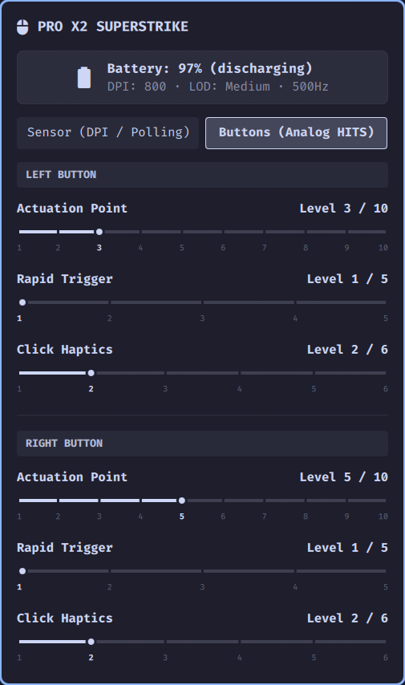

# Logitech G Mouse

[English](README.md) | **繁體中文**

適用於 Logitech G 系列電競滑鼠的 [Omarchy Quattro](https://omarchy.org/) 狀態列小工具與控制面板。無需 Logitech G HUB，即可讀取電池狀態，並調整 DPI、回報率；支援的滑鼠還可調整 HITS 類比按鍵設定。

## 需求

- x86_64 Linux 上的 Omarchy Quattro。
- 可透過 `/dev/hidraw` 存取的 Logitech G 滑鼠。

外掛隨附原生控制程式；使用時不需要 Bun、Node.js、Python 或 Rust。

## 安裝

### 從 GitHub 安裝

```bash
omarchy plugin add https://github.com/ttymayor/oma-logitech-g-mouse.git --enable
omarchy restart shell
```

### 從本機原始碼安裝

```bash
mkdir -p ~/.config/omarchy/plugins/tantuyu.logitech-g-mouse
cp -a . ~/.config/omarchy/plugins/tantuyu.logitech-g-mouse/
omarchy plugin validate ~/.config/omarchy/plugins/tantuyu.logitech-g-mouse
omarchy-shell shell rescanPlugins
omarchy plugin enable tantuyu.logitech-g-mouse --section right
omarchy restart shell
```

## 使用方式

- **左鍵點擊**狀態列小工具以開啟控制面板。
- **右鍵點擊**切換是否顯示電量百分比。
- 在 **Sensor** 分頁選擇 DPI 預設值、以每次 50 DPI 調整 DPI，或選取滑鼠支援的回報率。
- 相容的類比按鍵滑鼠可在 **Buttons** 分頁分別設定 Actuation Point、Rapid Trigger 與 Click Haptics。

小工具會在開機或接收器重新連線後自動重連，最多等待五秒讓接收器完成初始化。

## 截圖

| Sensor 分頁                                         | Buttons 分頁 tab                                |
| --------------------------------------------------- | ----------------------------------------------- |
|  |  |

## 疑難排解

Omarchy 與其他使用 systemd 的桌面會話通常會由 `systemd-logind` 透過 `uaccess` 自動授予登入使用者 `/dev/hidraw*` 的存取權。

若小工具持續顯示離線，先確認原生控制程式是否能偵測滑鼠：

```bash
~/.config/omarchy/plugins/tantuyu.logitech-g-mouse/bin/logitech-g-daemon --once
```

如果回傳 `EACCES: Permission denied`，表示目前會話沒有 HID 裝置權限。容器、無桌面會話環境，或沒有 `systemd-logind` 的系統可能發生此情況。可用時請維持原本的 `uaccess` 作法；無桌面會話系統則只授予專用本機群組存取權：

```bash
sudo groupadd --system logitech-hidraw
sudo usermod -aG logitech-hidraw "$USER"
sudo tee /etc/udev/rules.d/42-logitech-mouse.rules << 'EOF'
SUBSYSTEM=="hidraw", ATTRS{idVendor}=="046d", GROUP="logitech-hidraw", MODE="0660"
EOF
sudo udevadm control --reload
sudo udevadm trigger
```

新增群組成員資格後，請登出再登入。

## 解除安裝

```bash
omarchy plugin disable tantuyu.logitech-g-mouse
omarchy plugin remove tantuyu.logitech-g-mouse --yes
omarchy restart shell
```

若是手動安裝的外掛：

```bash
omarchy plugin disable tantuyu.logitech-g-mouse
rm -rf "${XDG_RUNTIME_DIR:-/run/user/$UID}/omarchy-logitech-g-mouse"
omarchy restart shell
```

## 開發

[DEVELOPMENT.md](DEVELOPMENT.md)

## 授權

[MIT License](LICENSE)。Logitech、G PRO 與 SUPERSTRIKE 是 Logitech 的商標；本專案為獨立第三方開源外掛，與 Logitech 無隸屬關係。
